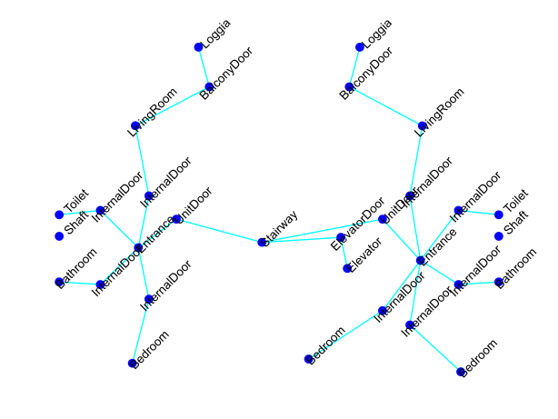
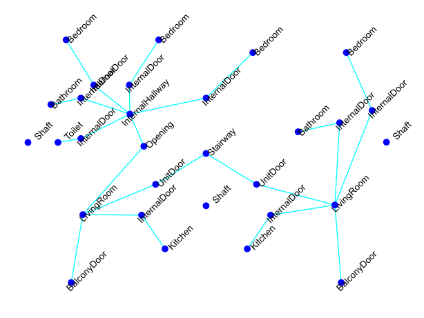
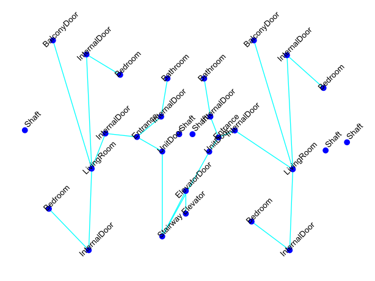
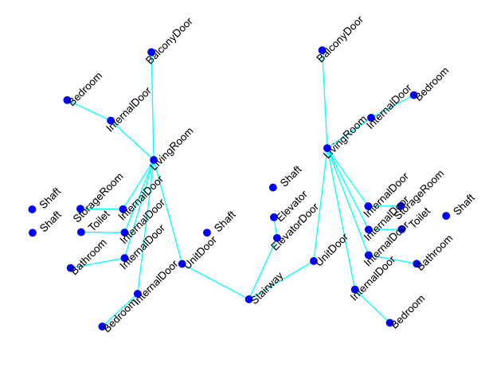

### 1. Introduction:

The analysis of building models for usable area, building safety, and energy use requires accurate classification data of spaces and space elements. To reduce input model preparation effort and errors, automated classification of spaces and space elements is desirable. A barrier to the application of Graph Deep Learning (GDL) methods to space function and space element classification is a lack of suitable datasets. To bridge this gap, we introduce a dataset, SAGC-A68, which comprises access graphs automatically generated from 68 digital 3D models of space layouts of apartment buildings. This graph-based dataset is well-suited for developing GDL models for space function and space element classification. To demonstrate the potential of the dataset, we employ it to train and evaluate a Graph Attention Network (GAN) that predicts 22 space function and 6 space element classes. <b>The [dataset](https://doi.org/10.5281/zenodo.7805872) and [code](https://github.com/A2Amir/SAGC-A68/blob/main/Graph.ipynb) used in the experiment are available online</b>.

<table align="center">
<tr><th colspan="2">Space access graphs with the corresponding node labels</th></tr>
<tr>
    <td></td>
    <td></td>
  </tr>
    <tr>
    <td></td>
    <td></td>
  </tr>
 </table>

Each access graph contains nodes representing spaces and space elements and edges representing the connection between them. Nodes are uniquely identified and characterized by 16 features including “Position X”, “Position Y”, “Position Z”, “Width”, “Height”, “Depth”, “Area”, “Volume”, “Is_internal”, “Door_opening_quantity”, “Window_quantity”, “Max_door_width”,” Encloses_ws”, “Is_contained_in_ws”, ”bounding_box”, and “Label” (28 identified labels are shown in bold type in Table 1). Edges are identified by a unique ID and characterized by three features, including “Z_angle”, “Delta_z”, and “Length”. In total, the dataset comprises 4871 nodes and 4566 edges, including disconnected nodes representing shafts.

<table border="0" align="center"  width="50" >
 <tr>
    <td><b style="font-size:30px">Space function classes  [Count]</b></td>
    <td><b style="font-size:30px">Space element classes [Count]</b></td>
 </tr>
 <tr >
  <td>
   <pre><code class="lang-txt" width="50">
     [Space]
     ├── [ResidentialSpace]
     │   ├── [CommunalSpace]
     │   │   ├── <b>(DiningRoom)[3]</b>
     │   │   ├── <b>(FamilyRoom)[6]</b>
     │   │   └── <b>(LivingRoom)[275]</b>
     │   └── [PrivateSpace]
     │       ├── <b>(Bedroom)[495]</b>
     │       │   ├── <b>(MasterBedroom)[23]</b>
     │       │   └── <b>(BoxRoom)[2]</b>
     │       └── <b>(HomeOffice)[8]</b>
     ├── [ServiceSpace]
     │   ├── <b>(Shaft)[403]</b>
     │   ├── <b>(StorageRoom)[84]</b>
     │   │   └── <b>(WalkInCloset)[2]</b>
     │   └── [SanitarySpace]
     │       ├── <b>(Bathroom)[274]</b>
     │       ├── <b>(Toilet)[145]</b>
     │       ├── <b>(Kitchen)[117]</b>
     │       └── <b>(LaundryRoom)[57]</b>
     ├── [CirculationSpace]
     │   ├── [VerticalCirculationSpace]
     │   │   ├── <b>(Elevator)[86]</b>
     │   │   └── <b>(Stairway)[70]</b>
     │   └── [HorizontalCirculationSpace]
     │       ├── <b>(Entrance)[67]</b>
     │       └── <b>(Hallway)[12]</b>
     │           ├── <b>(MainHallway)[18]</b>
     │           └── <b>(InternalHallway)[152]</b>
     └── [ExternalSpace]
         ├── <b>(AccessBalcony)[19]</b>
         └── <b>(Loggia)[108]</b>
   </code></pre>
    </td>
 <td>
   <pre ><code class="lang-txt" >
    [root]
    └── [SpaceElement]
        └── [SpaceEnclosingElement]
            ├── <b>(Opening)[140]</b>
            └── [Door]
                ├── <b>(InternalDoor)[1428]</b>
                ├── <b>(UnitDoor)[291]</b>
                └── <b>(SideEntranceDoor)[84]</b>
                └── <b>(ElevatorDoor)[492]</b>
                └── <b>(BalconyDoor)[10]</b>
      </code></pre>
  </td>
 </tr>
</table>

### 2. Prerequisites
In order to use the helper codes, create the environment from the environment.yml file  

        conda env create -f environment.yml

Activate the new environment: 

        conda activate graph
        
Verify that the new environment was installed correctly

        conda env list
      
        

### 3. Model training:

Since a typical Graph Attention Network only takes node features into node embeddings, we extend GAN to incorporate edge features. We then used the dataset to train the extended GAN from scratch, we used a simple training strategy, starting with a learning rate of 0.001, training the model 5000 epochs, and saving the best model with the lowest error on the training dataset. The outputs of the extended GAN model for the test dataset are evaluated by Precision, Recall, and F1-Score metrics. See the [code and result](https://github.com/A2Amir/SAGC-A68/blob/main/Graph.ipynb) here.

### 4. Acknowledgments

The authors (Amir Ziaee, Georg Suter) gratefully acknowledge support by Grant Austrian Science Fund (FWF): I 5171-N, Laura Keiblinger, and participants in course '259.428-2021S Architectural Morphology' at TU Wien for data collection.

